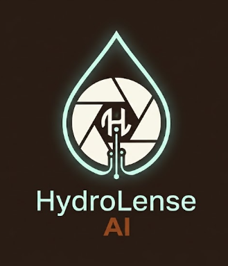
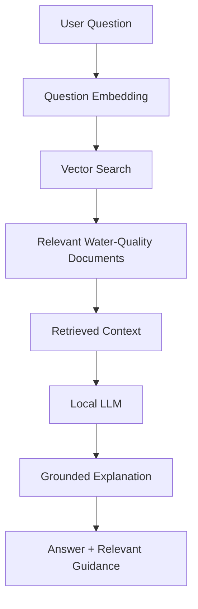
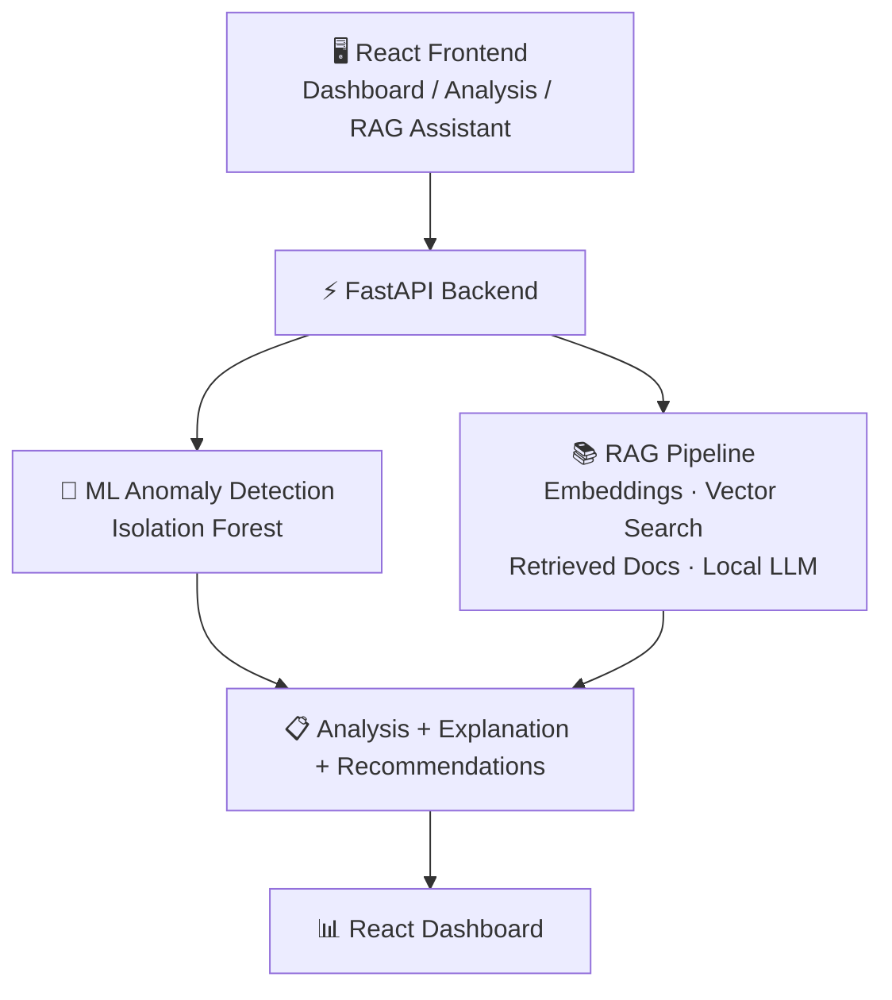
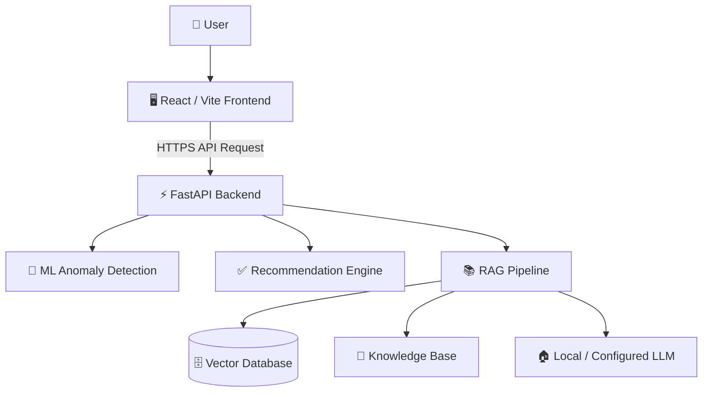

<div align="center">



# 💧 HydroLenseAI

### **Water Quality Anomaly Detection & RAG Early-Warning Assistant**

[](https://react.dev)
[](https://vitejs.dev)
[](https://fastapi.tiangolo.com)
[](https://www.python.org)
[](https://scikit-learn.org)
[](https://ollama.com)
[](https://www.trychroma.com)
[](https://vercel.com)

</div>

**🔬 Water Quality Anomaly Detection & RAG Early-Warning Assistant**

HydroLenseAI is an AI-powered water-quality monitoring and decision-support platform that detects unusual patterns in water-quality measurements and provides explainable, evidence-based guidance for faster verification.

It combines **machine-learning anomaly detection**, **Retrieval-Augmented Generation (RAG)**, a **local Large Language Model (LLM)** and an **interactive web dashboard** into a single workflow.

Instead of simply asking a general-purpose AI chatbot whether a set of water measurements is concerning, HydroLenseAI:

1. 📊 Processes structured water-quality data through a dedicated anomaly-detection model
2. 🚨 Identifies statistically unusual patterns
3. 📚 Retrieves relevant water-quality guidance from a curated knowledge base
4. 💬 Generates an explanation with recommended verification steps

> ⚠️ **Disclaimer:** HydroLenseAI is an early-warning and decision-support tool. It is **not** a replacement for laboratory testing, certified water-quality assessment, or decisions by qualified authorities.

---

## 📸 Screenshots

<div align="center">
        
### `Dashboard`


### `Analysis`


### `RAG Assistant`


### `Recent`


### `About`


---
<div align="left">
        
## 📑 Table of Contents

- [Problem Statement](#-problem-statement)
- [Sustainable Development Goal](#-sustainable-development-goal)
- [Key Objectives](#-key-objectives)
- [How HydroLenseAI Works](#-how-hydrolenseai-works)
- [RAG-Based Water-Quality Assistant](#-rag-based-water-quality-assistant)
- [Explainable Anomaly Analysis](#-explainable-anomaly-analysis)
- [Recommendations Engine](#-recommendations-engine)
- [Web Application](#-web-application)
- [Main Features](#-main-features)
- [Responsible AI](#-responsible-ai)
- [Technology Stack](#-technology-stack)
- [Project Structure](#-project-structure)
- [Deployment Architecture](#-deployment-architecture)
- [Future Scope](#-future-scope)
- [Project Impact](#-project-impact)

---

## 🎯 Problem Statement

Water-quality issues can involve multiple parameters such as pH, turbidity, total dissolved solids, dissolved oxygen, temperature, and conductivity. Looking at these measurements individually can make it difficult to recognize unusual combinations or changes from an expected baseline.

HydroLenseAI addresses this through the following question:

> *"How might we use AI to detect unusual patterns in water-quality data and provide explainable early warnings so that potential water-quality issues can be identified and verified more quickly?"*

The goal is to move users from raw measurements to a structured early-warning workflow:

```
Water-quality readings → Anomaly detection → Risk indication
        → Evidence retrieval → Explanation → Recommended verification
```

---

## 🌍 Sustainable Development Goal

HydroLenseAI primarily supports **SDG 6 — Clean Water and Sanitation**.

The project focuses on improving the ability to identify unusual water-quality patterns and support faster verification of potential issues. It aligns with the broader objective of improving water quality and reducing pollution-related risks through technology-enabled monitoring and decision support.

---

## 🎯 Key Objectives

HydroLenseAI is designed to:

- 🔎 Detect unusual patterns across multiple water-quality parameters
- 📈 Provide an anomaly score and anomaly classification
- 💡 Explain why a reading has been flagged
- 📚 Retrieve relevant information from a curated water-quality knowledge base
- 🤖 Generate contextual responses using a local LLM
- ✅ Provide practical verification and follow-up recommendations
- 🖥️ Display water-quality information through an interactive web interface
- 📡 Provide a foundation that can later connect to real sensor stations or historical monitoring systems
- 🧭 Stay transparent about the limitations of AI-based anomaly detection

---

## ⚙️ How HydroLenseAI Works

The system follows a multi-stage pipeline.

### 1️⃣ Water-Quality Input

The user provides structured measurements such as:

- 🧪 pH
- 🌫️ Turbidity
- 💠 Total Dissolved Solids (TDS)
- 🌡️ Temperature
- 🫧 Dissolved Oxygen
- ⚡ Electrical Conductivity

The system validates and processes these measurements before sending them to the anomaly-detection pipeline.

### 2️⃣ Data Processing

The Python data-processing pipeline cleans and prepares water-quality data:

- Removing duplicate records
- Handling missing or invalid values
- Converting measurements into appropriate numeric formats
- Processing timestamps
- Creating additional derived features

Derived feature relationships include:

- TDS-to-conductivity ratio
- Dissolved-oxygen-to-temperature ratio

These features allow the model to consider relationships between measurements rather than treating every parameter completely independently.

### 3️⃣ Machine-Learning Anomaly Detection

HydroLenseAI uses an **Isolation Forest** anomaly-detection model. The model learns the general pattern of the available baseline data and identifies observations that differ significantly from that learned pattern.

The pipeline uses:

- Feature scaling with `StandardScaler`
- `IsolationForest`
- A reproducible random state
- A configured contamination level
- A saved trained model using `.pkl`

The model produces:

- 🏷️ Anomaly label
- ✔️ Boolean anomaly result
- 📊 Anomaly score

An observation is identified as either a **normal pattern** or an **unusual / anomalous pattern**. The anomaly score indicates how unusual the observation is relative to the learned baseline.

---

## 🧠 RAG-Based Water-Quality Assistant

HydroLenseAI includes a **Retrieval-Augmented Generation (RAG)** architecture, making the assistant more useful than a fixed-response chatbot. Instead of relying only on information encoded in the application's Python code, the assistant retrieves relevant information from a dedicated water-quality knowledge base before generating an answer.

### 🔄 RAG Workflow



### 📚 Knowledge Base

The knowledge base contains curated water-quality and safety information in structured Markdown documents. It can include:

- WHO water-quality guidance
- Water-safety guidance
- Anomaly-response guidance
- Project-specific water-quality explanations
- Verification recommendations

Official source material can be added to the project's knowledge-base directory and indexed for retrieval. The knowledge base can be expanded without rewriting the core application logic.

### 🔍 Vector Retrieval

The RAG architecture uses **semantic retrieval** rather than simple keyword matching:

1. Water-quality documents are divided into smaller chunks.
2. Each chunk is converted into an embedding using a sentence-transformer model.
3. The embeddings are stored in a persistent vector database.

When the user asks a question:

1. The question is converted into an embedding.
2. The vector store searches for semantically relevant document chunks.
3. The most relevant information is retrieved.
4. The retrieved context is provided to the language model.
5. The language model generates the final response based on that context.

Questions with different wording but similar meaning can therefore retrieve related information.

### 🏠 Local LLM Integration

The RAG assistant is designed to use a local LLM through **Ollama**, so the language-generation component can run locally without a paid cloud AI API.

The local LLM receives:

- The user's question
- Relevant retrieved knowledge
- System instructions
- HydroLenseAI's safety and responsibility requirements

It then generates a natural-language answer grounded in the retrieved information. A smaller local model can be used where hardware resources are limited.

### ❓ Why RAG Is Used

A general-purpose LLM can answer questions about water quality, but the RAG architecture provides a more controlled workflow. The assistant can:

- Retrieve project-approved information
- Ground answers in the project's knowledge base
- Provide more consistent responses
- Reduce dependence on the model's general training knowledge
- Allow the knowledge base to be updated independently
- Connect explanations to specific water-quality guidance

The system combines:

```
ML-based detection + retrieved evidence + LLM explanation
```

rather than using an LLM as the anomaly detector itself.

---

## 💡 Explainable Anomaly Analysis

When the ML model detects an unusual pattern, HydroLenseAI generates an explanation in understandable terms. It can communicate that:

- The submitted measurements differ from the learned baseline
- The pattern has been statistically flagged as unusual
- The result should be verified
- Sensor calibration or measurement errors should be considered
- Historical and nearby readings can be compared
- Persistent unusual patterns may require field or laboratory verification

The system deliberately avoids presenting an anomaly as proof that water is unsafe.

---

## ✅ Recommendations Engine

HydroLenseAI provides recommended follow-up actions based on the analysis. Typical recommendations include:

- 🔧 Verify the sensor reading and check for measurement or calibration errors
- 🕰️ Compare the observation with recent historical readings
- 📍 Compare the result with nearby measurements where available
- 🧫 If the unusual pattern persists, arrange appropriate field or laboratory verification
- 🚫 Do not treat the model result alone as proof that water is safe or unsafe

These recommendations turn model output into an actionable early-warning workflow.

---

## 🖥️ Web Application

### 🎨 Frontend

Built using **React**, **Vite**, **JavaScript**, **React Router** and **Recharts**. It provides the user-facing interface for:

- Dashboard monitoring
- Water-quality analysis
- Interactive inputs
- Anomaly results
- Risk information
- Recommendations
- Charts and visualizations
- RAG assistant interaction

### 🔧 Backend

Built using **Python**, **FastAPI**, **Pydantic** and **Uvicorn**. It provides API endpoints that connect the frontend to:

- Machine-learning models
- Data-processing functions
- RAG retrieval
- Local LLM generation
- Recommendation logic

The frontend communicates with the backend through HTTP API requests.

### 🗺️ Main Application Flow



---

## ✨ Main Features

### 📊 Water Quality Dashboard

The dashboard provides an overview of the monitoring environment and can display:

- Overall water-quality information
- Recent anomalies
- Monitoring activity
- System status
- Parameter trends
- Historical readings
- Flagged observations

Charts can visualize parameters such as pH, turbidity, and dissolved oxygen over time.

### 🧪 Water Analysis

The Analysis section lets users enter water-quality measurements and run an analysis. The system returns:

- Anomaly status
- Anomaly label
- Anomaly score
- Risk indication
- Explanation
- Recommendations
- Safety disclaimer

This allows users to test individual readings or scenarios through the same analysis pipeline.

### 💬 RAG Assistant

The RAG Assistant lets users ask questions related to water quality. Example questions:

- *"Why can turbidity be important?"*
- *"What should I check if a sensor suddenly reports an unusual value?"*
- *"What does an anomaly mean?"*
- *"What should be verified before taking action?"*
- *"How can historical readings help investigate an anomaly?"*

The assistant retrieves relevant knowledge and generates a contextual response using the local LLM.

---

## 🛡️ Responsible AI

Responsible AI is a core part of HydroLenseAI.

- 🔍 **Transparency:** The system clearly distinguishes between *anomaly detection* and *water-safety determination*. An anomaly means a measurement pattern differs from the model's learned baseline. It does not automatically mean the water is contaminated or unsafe.
- 🧑‍⚖️ **Human verification:** The system recommends appropriate verification instead of automatically making consequential real-world decisions.
- 💡 **Explainability:** The platform provides an explanation alongside the anomaly result rather than displaying only a prediction.
- 🔒 **Privacy:** A local LLM can be used for the RAG assistant, reducing the need to send user-provided water-quality information to an external AI service.

### ⚠️ Limitations

- The anomaly model depends on the quality and representativeness of its training data.
- The prototype uses **demonstration / synthetic data** and should not be presented as a validated real-world water-quality certification system.

---

## 🧰 Technology Stack

| Area | Technologies |
|---|---|
| 🎨 **Frontend** | React, Vite, JavaScript, React Router, Recharts, CSS |
| 🔧 **Backend** | Python, FastAPI, Uvicorn, Pydantic |
| 🤖 **Machine Learning** | Scikit-learn, Isolation Forest, StandardScaler, Pandas, NumPy, Joblib |
| 📚 **RAG** | Sentence Transformers, ChromaDB / vector storage, semantic embeddings |
| 🏠 **Local LLM** | Ollama |
| 📝 **Knowledge Base** | Markdown documents |
| 🗃️ **Data** | CSV, Pandas, synthetic demonstration water-quality dataset |
| 🚀 **Deployment** | Vercel (frontend), Vercel (backend/API), local Ollama for the local RAG development architecture |

---

## 📁 Project Structure

```
HydroLenseAI/
│
├── api/
│   └── index.py
│
├── backend/
│   ├── main.py
│   ├── api/
│   │   ├── analysis.py
│   │   └── chat.py
│   └── services/
│       ├── anomaly_service.py
│       ├── rag_service.py
│       └── recommendation_service.py
│
├── data/
│   ├── raw/
│   ├── processed/
│   ├── sample/
│   └── vector_store/
│
│
├── models/
│   ├── anomaly_detector.pkl
│   ├── scaler.pkl
│   └── model_metadata.json
│
├── src/
│   ├── data/
│   │   ├── load_data.py
│   │   ├── clean_data.py
│   │   └── feature_engineering.py
│   │
│   ├── models/
│   │   ├── train_model.py
│   │   ├── detect_anomaly.py
│   │   └── evaluate_model.py
│   │
│   ├── rag/
│   │   ├── build_knowledge_base.py
│   │   ├── retrieve_guidance.py
│   │   ├── generate_explanation.py
│   │   ├── vector_store.py
│   │   └── local_llm.py
│   │
│   ├── assistant/
│   │   ├── water_analyzer.py
│   │   ├── risk_explainer.py
│   │   └── recommendations.py
│   │
│   └── utils/
│       ├── config.py
│       └── logger.py
│
├── knowledge_base/
│   ├── water_quality_guidelines/
│   │   ├── guideline_summary.md
│   │   ├── WHO_sources.md
│   │   └── WHO_guidelines.pdf
│   │
│   └── water_safety/
│       ├── water_safety_guidance.md
│       └── anomaly_response.md
│
├── prompts/
│   ├── system_prompt.txt
│   ├── anomaly_explanation_prompt.txt
│   ├── recommendation_prompt.txt
│   └── rag_assistant_prompt.txt
│
├── frontend/
│   ├── package.json
│   ├── vite.config.js
│   └── src/
│       ├── components/
│       ├── pages/
│       ├── styles/
│       └── utils/
│
├── requirements.txt
├── requirements-rag.txt
├── vercel.json
└── README.md
```

---

## ☁️ Deployment Architecture

The project can be deployed as separate frontend and backend applications.



The deployed frontend provides the user-facing application, while the backend provides the API services consumed by the frontend.

---

## 🔭 Future Scope

HydroLenseAI can be expanded into a larger real-world monitoring platform by adding:

- 📡 Live IoT water-quality sensors
- 🏭 Real-time monitoring stations
- 🗄️ Historical database storage
- 🗺️ Geographic monitoring maps
- 📍 Multiple monitoring locations
- 🔔 Automated anomaly alerts
- 📧 Email / SMS / notification systems
- 🧪 More water-quality parameters
- ✅ Real-world validated datasets
- 📖 More comprehensive official guidance sources
- 🔗 Improved vector retrieval and document citation
- ☁️ Cloud-hosted LLM and vector infrastructure for production RAG
- 👥 Role-based dashboards for communities, researchers, institutions, and monitoring authorities
- 🔄 Model retraining using validated local datasets

---

## 🌱 Project Impact

HydroLenseAI demonstrates how AI can act as a supporting layer for environmental monitoring. Instead of replacing experts or laboratory testing, it helps transform raw water-quality measurements into:

```
Detection → Context → Explanation → Verification
```

This can help users identify unusual patterns earlier, understand why an observation was flagged, retrieve relevant guidance, and determine what should be verified next.

The project combines machine learning, semantic retrieval, generative AI, data visualization, and responsible AI principles within an SDG-focused sustainability application.

---

## 📄 License

MIT License

Copyright (c) 2026 Minaal Naik

Permission is hereby granted, free of charge, to any person obtaining a copy
of this software and associated documentation files (the "Software"), to deal
in the Software without restriction, including without limitation the rights
to use, copy, modify, merge, publish, distribute, sublicense, and/or sell
copies of the Software, and to permit persons to whom the Software is
furnished to do so, subject to the following conditions:

The above copyright notice and this permission notice shall be included in all
copies or substantial portions of the Software.

THE SOFTWARE IS PROVIDED "AS IS", WITHOUT WARRANTY OF ANY KIND, EXPRESS OR
IMPLIED, INCLUDING BUT NOT LIMITED TO THE WARRANTIES OF MERCHANTABILITY,
FITNESS FOR A PARTICULAR PURPOSE AND NONINFRINGEMENT. IN NO EVENT SHALL THE
AUTHORS OR COPYRIGHT HOLDERS BE LIABLE FOR ANY CLAIM, DAMAGES OR OTHER
LIABILITY, WHETHER IN AN ACTION OF CONTRACT, TORT OR OTHERWISE, ARISING FROM,
OUT OF OR IN CONNECTION WITH THE SOFTWARE OR THE USE OR OTHER DEALINGS IN THE
SOFTWARE.

